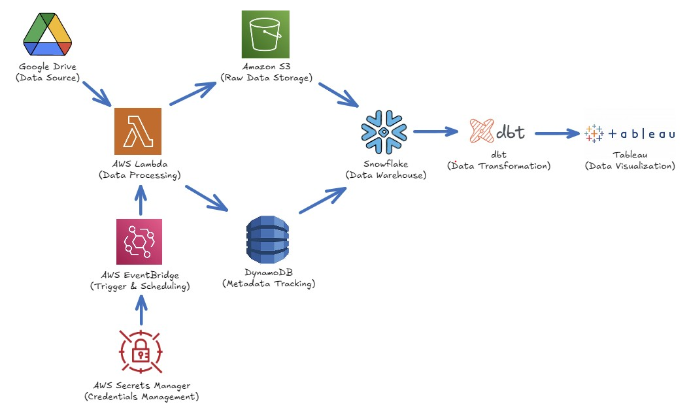

# 🏥 Nurse Data ETL Pipeline

## 📋 Table of Contents
- [Project Overview](#project-overview)
- [System Architecture](#system-architecture)
- [Pipeline Components](#pipeline-components)
- [Technologies Used](#technologies-used)
- [Getting Started](#getting-started)
- [Future Enhancements](#future-enhancements)

---

## 📝 Project Overview

A serverless and scalable ETL pipeline built to process nurse staffing and healthcare operational data from multiple hospital sources. The pipeline ingests raw data from Google Drive, processes it through AWS Lambda, stores and transforms it using Snowflake + dbt, and visualizes key metrics via Tableau dashboards.

---

## 🏗️ System Architecture

**ETL Flow Overview:**

---

## 🧩 Pipeline Components

### 🔍 Data Ingestion

- **Google Drive**  
  Uploads raw CSV files for ingestion.

- **AWS Lambda**  
  Handles file retrieval and validation, then uploads to S3.

- **Amazon S3**  
  Stores raw files temporarily before ingestion into the warehouse.

---

### 🔄 Metadata & Scheduling

- **AWS EventBridge**  
  Triggers Lambda functions on schedule or upload events.

- **AWS Secrets Manager**  
  Manages API keys and Snowflake credentials securely.

- **DynamoDB**  
  Tracks processed files and prevents duplication or reprocessing.

---

### 🧠 Data Warehousing & Transformation

- **Snowflake**  
  Central data warehouse for storing processed datasets.

- **dbt (Data Build Tool)**  
  Transforms and cleans the data into analytical models using SQL.

---

### 📊 Data Visualization

- **Tableau**  
  Connects to Snowflake and visualizes KPIs such as nurse-to-patient ratios, shift patterns, and staffing needs.

---

## 🛠️ Technologies Used

| Tool | Purpose |
|------|---------|
| **Google Drive API** | Source of uploaded CSVs |
| **AWS Lambda** | Data extraction and automation |
| **Amazon S3** | Raw file storage |
| **AWS EventBridge** | Scheduled or event-based ETL triggers |
| **AWS Secrets Manager** | Secure credential storage |
| **DynamoDB** | Metadata and ingestion tracking |
| **Snowflake** | Data warehousing and analytics |
| **dbt** | SQL-based transformation models |
| **Tableau** | Visualization and reporting |

---

## ⏭️ Future Enhancements

| Feature | Description |
|---------|-------------|
| **CI/CD Pipeline** | Automate deployment of Lambda/dbt using GitHub Actions |
| **Kubernetes Migration** | Containerize dbt transformations and enable distributed execution |
| **Real-time Streaming** | Add Kinesis or Kafka for real-time nursing data flow |
| **Data Quality Alerts** | Notify anomalies or ingestion failures via Slack/email |
| **User-facing Portal** | Build a frontend dashboard for non-technical hospital staff |

---
